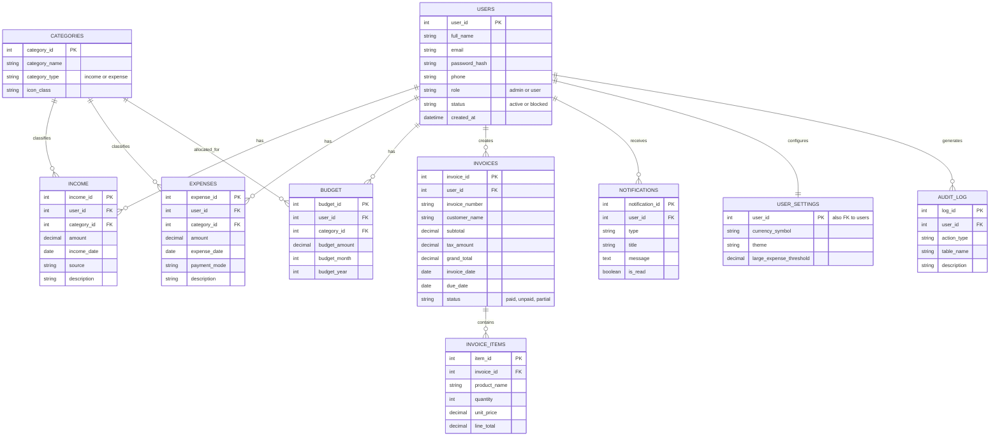

# ER Diagram

Below is the Entity-Relationship (ER) diagram for FinancePro.

```mermaid
erDiagram
    USERS ||--o{ INCOME : has
    USERS ||--o{ EXPENSES : has
    USERS ||--o{ BUDGET : has
    USERS ||--o{ INVOICES : creates
    USERS ||--o{ NOTIFICATIONS : receives
    USERS ||--|| USER_SETTINGS : configures
    USERS ||--o{ AUDIT_LOG : generates

    CATEGORIES ||--o{ INCOME : classifies
    CATEGORIES ||--o{ EXPENSES : classifies
    CATEGORIES ||--o{ BUDGET : allocated_for

    INVOICES ||--o{ INVOICE_ITEMS : contains

    USERS {
        int user_id PK
        string full_name
        string email
        string password_hash
        string phone
        string role "admin or user"
        string status "active or blocked"
        datetime created_at
    }

    CATEGORIES {
        int category_id PK
        string category_name
        string category_type "income or expense"
        string icon_class
    }

    INCOME {
        int income_id PK
        int user_id FK
        int category_id FK
        decimal amount
        date income_date
        string source
        string description
    }

    EXPENSES {
        int expense_id PK
        int user_id FK
        int category_id FK
        decimal amount
        date expense_date
        string payment_mode
        string description
    }

    BUDGET {
        int budget_id PK
        int user_id FK
        int category_id FK
        decimal budget_amount
        int budget_month
        int budget_year
    }

    INVOICES {
        int invoice_id PK
        int user_id FK
        string invoice_number
        string customer_name
        decimal subtotal
        decimal tax_amount
        decimal grand_total
        date invoice_date
        date due_date
        string status "paid, unpaid, partial"
    }

    INVOICE_ITEMS {
        int item_id PK
        int invoice_id FK
        string product_name
        int quantity
        decimal unit_price
        decimal line_total
    }

    NOTIFICATIONS {
        int notification_id PK
        int user_id FK
        string type
        string title
        text message
        boolean is_read
    }

    USER_SETTINGS {
        int user_id PK "also FK to users"
        string currency_symbol
        string theme
        decimal large_expense_threshold
    }

    AUDIT_LOG {
        int log_id PK
        int user_id FK
        string action_type
        string table_name
        string description
    }
```
